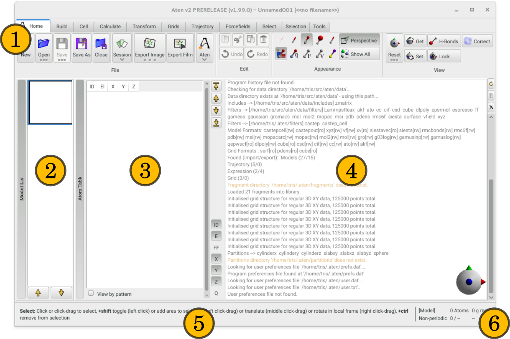

The main window of **Aten** (in version 2.0) mimicks the 'ribbon' style toolbar (**1**) of popular office-related software. Much of the primary focus of the main window is on the model viewing canvas (**4**) which also doubles as a message display area.

{.imgfull}

### Toolbar (1)

All of **Aten**'s core functionality, tools, and actions are encapsulated in the toolbar at the top of the main window (**1**). Each set of tools is grouped by a specific panel, and within that panel further separated and grouped by specific functionality. Each panel and the tools it contains is described in detail in the forthcoming sections.

### Main View (2)

The Main View (**2**) is where the current model(s) is (are) displayed - exactly which of the currently-loaded models are displayed is controlled by the selection in the Model List

The edges of the main window, around the canvas, are standard (Qt4) dock areas, in which the toolbox and any of the tool windows can be placed. Once you have the various subwindows set up how you like them, press **Settings→Store Default Window State **to remember these settings for when **Aten** next starts.

**Aten**’s main window is predominantly taken up with the rendering canvas where model(s) are displayed. Multiple models may be displayed simultaneously – the ‘current’ model (i.e. the one to which all editing / data operations are send) always has a black box drawn around it. A single toolbar sits above the canvas providing quick access to file, edit, and select actions. All other functionality is contained with various tool windows. These tool windows are accessed by the ToolBox widget, which by default is the only window displayed on startup (if it is not visible, you can raise and centre it on the main window from the menu item **Settings→Show Toolbox**). At the foot of the window is a status bar reflecting the content of the current model, listing the number of atoms and the number of selected atoms (bold value in parentheses, but only if there are selected atoms), the mass of the model, and the cell type and density (if the model is periodic).
