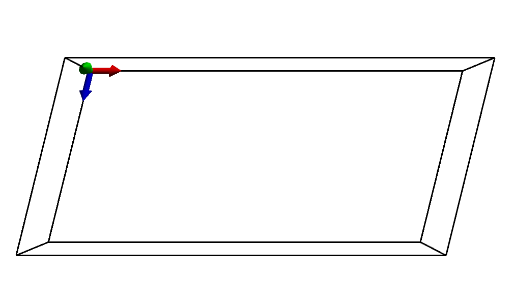
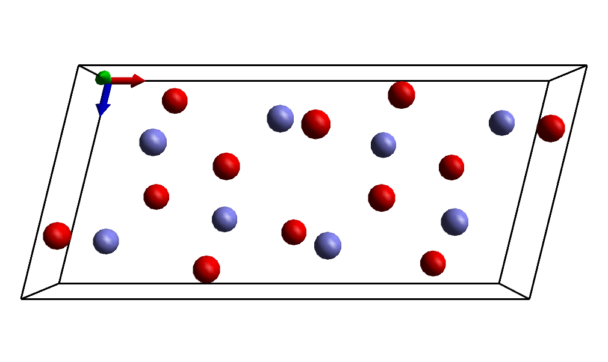

Crystal structures are useful for many things, provided you can find them in electronic format. When you can't and are left with the bare crystallographic data in a paper things are slightly more troublesome. This was exactly my experience when working with θ-alumina – the crystal information is readily available in a paper by Zhou and Snyder (_Acta. Cryst. B_, **47**, 617 (1991)), and here’s how to make use of it.

## Create the Unit Cell

First, we create the crystal cell in which to add our atoms. From the paper we see it is a monoclinic cell with β = 103.83°, and side lengths **A** = 11.854, **B** = 2.904, and **C** = 5.622 Å.

Go to the [**Cell Panel**](/aten/docs/gui/cell) and enable the **Periodic** button to create the basic unit cell, then the **Lengths** and **Angles** as detailed above. You may want to zoom out afterwards to get a proper look at the new cell.

{.imgfull}

## Add Symmetry Unique Atoms

There a five symmetry-unique atoms to add into the cell, which will in turn be used to generate the remaining 35 symmetry-related atoms to give the complete unit cell. To add the atoms we will use the **Add Atom** tool on the [**Build Panel**](/aten/docs/gui/build). Atom positions in the paper are given in fractional coordinates - we will create the atoms using these coordinates which will be converted to their ‘real’ equivalents by Aten (according to the current cell) as we add them.

First, change the current drawing **Element** to aluminium, and then create the following two atoms with the **Add Atom** tool (making sure that the **Fractional** checkbox is enabled):

| Atom | FracX | FracY | FracZ |
|------|-------|-------|-------|
| Al1  | 0.9166| 0.0   | 0.2073|
| Al2  | 0.6595| 0.0   | 0.3165|

Change the current **Element** to oxygen, and add the final three:

| Atom | FracX | FracY | FracZ |
|------|-------|-------|-------|
| O1   | 0.8272| 0.0   | 0.4273|
| O2   | 0.495 | 0.0   | 0.2526|
| O3   | 0.1611| 0.0   | 0.0984|

{.imgfull}

## Assign the Spacegroup and Pack

To complete the model the spacegroup of the crystal must be set so that generation of the symmetry-related atoms can be performed. This is all done on the spacegroup **Define** tool on the [**Cell Panel**](/aten/docs/gui/cell). The spacegroup can be entered as either its numeric ID (as listed in the IUC Tables) or as the unformatted spacegroup name, or selected from the drop-down list. θ-alumina belongs to spacegroup C2/m (number 12).

Once you have selected and **Set** spacegroup 12 by some means, symmetry-related copies of the five atoms present in the cell can then be generated with the **Pack** button. Any overlapping atoms resulting from the application of the spacegroup’s generators are automatically removed. Its also probably worth **Rebond**ing the model too.

That's it!  You might want to **Replicate** the resulting cell to create a larger chunk of material, or extend the unit cell and create a solid-liquid interface, or something utterly random.  The choice is yours.

{.imgfull}

## Script

```aten
# Create periodic model
newModel("alumina");
cell(11.854, 2.904, 5.622, 90, 103.83, 90);

# Add symmetry-unique atoms
newAtomFrac(Al,0.6595,0,0.3165);
newAtomFrac(Al,0.9166,0,0.2073);
newAtomFrac(O,0.8272,0,0.4272);
newAtomFrac(O,0.495,0,0.2526);
newAtomFrac(O,0.1611,0,0.0984);

# Set spacegroup, pack, and rebond
spacegroup("C2/m");
pack();
rebond();
```
